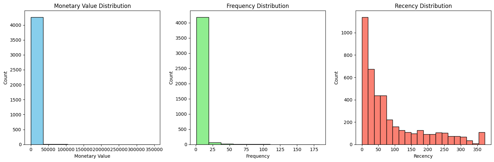
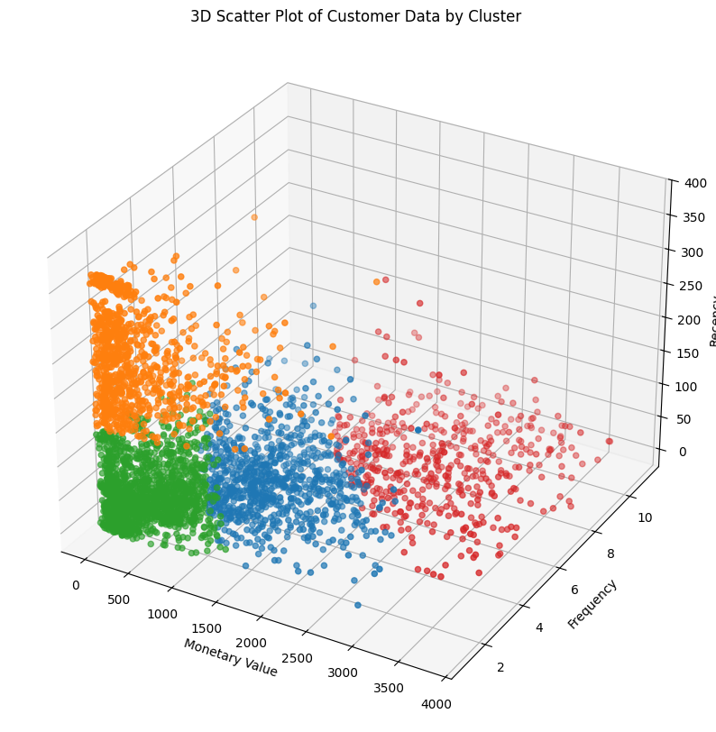
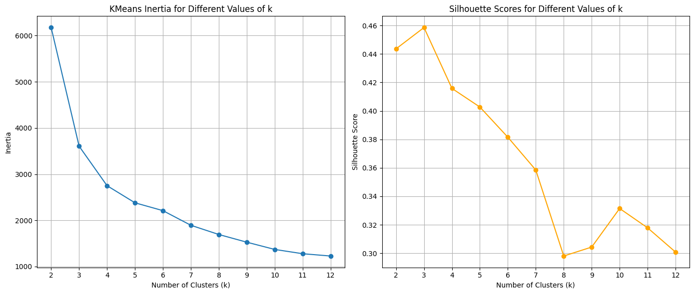
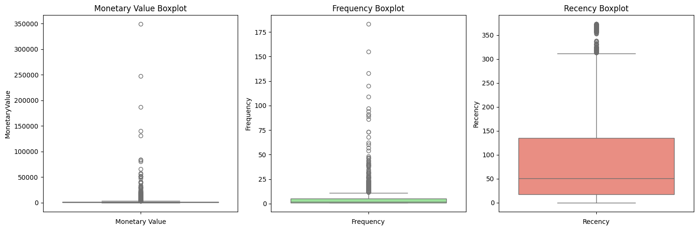
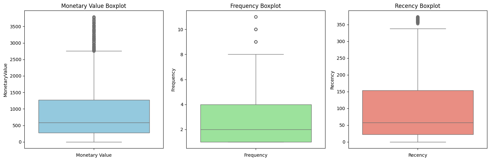
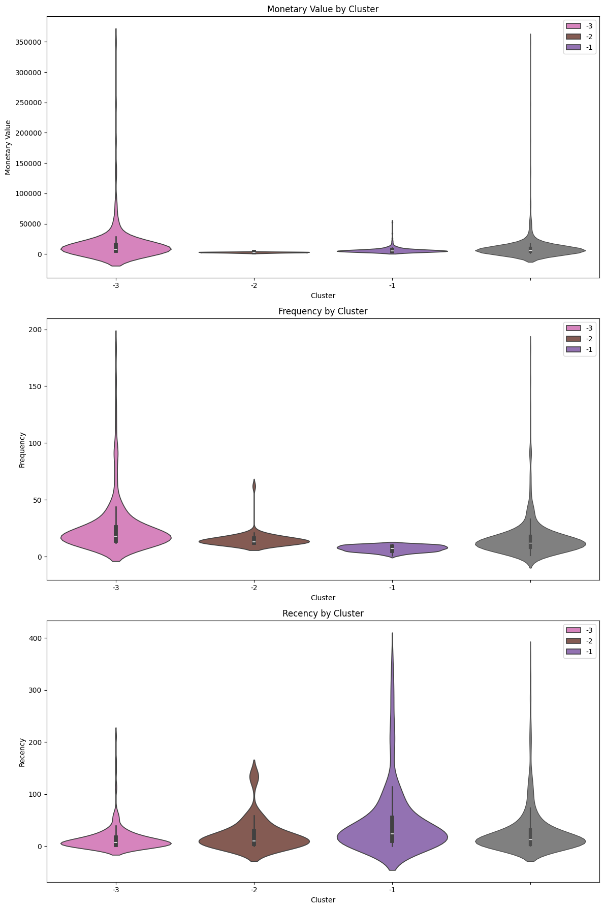

<div align="center"> 
  
  
  
  
  
</div>

# Customer Segmentation - Online Retail

Data Science project that dives deep into customer segmentation using Python, Pandas, Scikit-learn.
The Goal is to observe customer behavior in MRF (Monetary Value, Relevancy, and Frequency). Gain insights of customers.

  ## Table of Contents
  - [Overview](#overview)
  - [Installation](#installation)
  - [Usage](#usage)
  - [Data](#data)
  - [Results](#results)
  - [Contact](#license)

## Overview

Provide an overview of your notebook `main.ipynb`. Explain the purpose and main objectives of the project.
- Provide the executives deciding factor and next action to the customers. 
- Increase sales through understanding customer behavior
- Provide campaigns, sales, and strategic action plan for different segmented customers.

## Installation

Instructions on how to install the required packages:

```bash
pip install -r requirements.txt
```

## Usage

Explain how to run the notebook:

1. Clone the repository.
2. Navigate to the project directory.
3. Open `main.ipynb` with Jupyter Notebook or JupyterLab.

## Data

Describe the datasets used in the notebook and how to obtain them.

## Results











## Contact

- Alex Ro - [alexkimro@gmail.com](mailto:alexkimro@gmail.com)
- [LinkedIn](https://www.linkedin.com/in/alexkimro)
- [GitHub](https://github.com/alexkimrow)